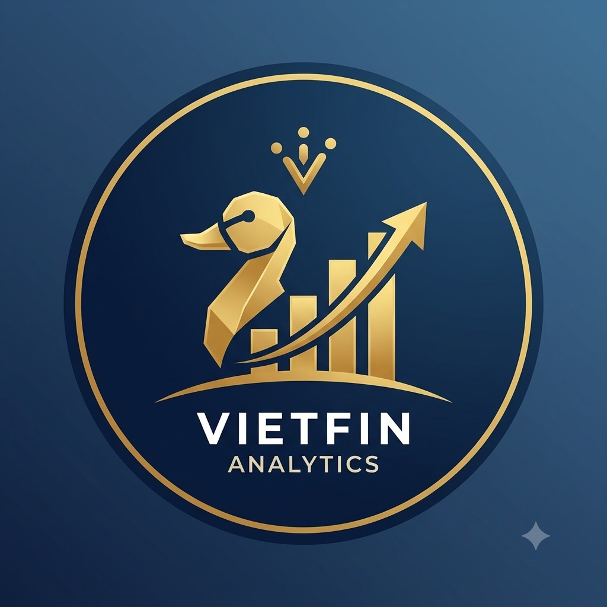

# VIETFIN — Vietnam Corporate Financial Intelligence Platform
<div align="center"> 


# VIETFIN ANALYTICS
### Enterprise Financial Intelligence & Analytical Data Platform for the Vietnamese Stock Market

[](https://www.python.org/)
[](https://duckdb.org/)
[](https://motherduck.com/)
[]()
[]()
[](LICENSE)


*An end-to-end, enterprise-grade ETL/ELT pipeline implementing Medallion Architecture to collect, clean, model, and serve financial statement data across all Vietnamese public exchanges (HOSE, HNX, UPCOM).*

</div>

---

## 📌 Executive Summary

**VietFin Analytics** is a scalable Data Engineering and Analytical Engine designed to standardize and process corporate financial statements from public markets in Vietnam. Built upon the **Medallion Data Lakehouse Architecture**, the platform ingests unstructured and semi-structured financial reporting metrics, standardizes them under the Vietnamese Accounting Standards (VAS) framework, and serves aggregated financial metrics via cloud-native OLAP engines (**MotherDuck / DuckDB**).

### Core Capabilities & Technical Metrics
* **Scale & Volume:** Manages **820,000+ granular financial statement line items** spanning balance sheets, income statements, and cash flow reports across the entire Vietnamese equity market.
* **Storage & Compute Paradigm:** Employs columnar local storage (**Apache Parquet**) for high-performance localized I/O, seamlessly integrated with **MotherDuck Cloud DW** for serverless, distributed analytical querying.
* **Feature Engineering (Gold Layer):** Automated calculation of corporate performance, liquidity, and leverage ratios, including Return on Equity (**ROE**), Return on Assets (**ROA**), Debt-to-Equity (**D/E**), Gross Profit Margin, and Net Profit Margin.
* **Data Governance & Provenance:** Full auditability via immutable tracking metadata (`source_name`, `retrieved_at`, `document_hash`), combined with strict execution rate-limiting.

---

## 🏗 Medallion Data Architecture

The platform processes data through three distinct architectural layers to guarantee data lineage, quality, and fast analytical performance:
Here is the complete, academic-grade `README.md` written in technical English for your GitHub repository.

```markdown
<div align="center">

# VIETFIN ANALYTICS
### Enterprise Financial Intelligence & Analytical Data Platform for the Vietnamese Stock Market

[](https://www.python.org/)
[](https://duckdb.org/)
[](https://motherduck.com/)
[]()
[]()
[](LICENSE)


*An end-to-end, enterprise-grade ETL/ELT pipeline implementing Medallion Architecture to collect, clean, model, and serve financial statement data across all Vietnamese public exchanges (HOSE, HNX, UPCOM).*

</div>

---

## 📌 Executive Summary

**VietFin Analytics** is a scalable Data Engineering and Analytical Engine designed to standardize and process corporate financial statements from public markets in Vietnam. Built upon the **Medallion Data Lakehouse Architecture**, the platform ingests unstructured and semi-structured financial reporting metrics, standardizes them under the Vietnamese Accounting Standards (VAS) framework, and serves aggregated financial metrics via cloud-native OLAP engines (**MotherDuck / DuckDB**).

### Core Capabilities & Technical Metrics
* **Scale & Volume:** Manages **820,000+ granular financial statement line items** spanning balance sheets, income statements, and cash flow reports across the entire Vietnamese equity market.
* **Storage & Compute Paradigm:** Employs columnar local storage (**Apache Parquet**) for high-performance localized I/O, seamlessly integrated with **MotherDuck Cloud DW** for serverless, distributed analytical querying.
* **Feature Engineering (Gold Layer):** Automated calculation of corporate performance, liquidity, and leverage ratios, including Return on Equity (**ROE**), Return on Assets (**ROA**), Debt-to-Equity (**D/E**), Gross Profit Margin, and Net Profit Margin.
* **Data Governance & Provenance:** Full auditability via immutable tracking metadata (`source_name`, `retrieved_at`, `document_hash`), combined with strict execution rate-limiting.

---

## 🏗 Medallion Data Architecture

The platform processes data through three distinct architectural layers to guarantee data lineage, quality, and fast analytical performance:


```

```
              ┌─────────────────────────────────────────┐
              │      Data Ingestion (APIs/Exchanges)    │
              └────────────────────┬────────────────────┘
                                   │
                                   ▼

```

┌───────────────────────────────────────────────────────────────────────────┐
│ BRONZE LAYER (Raw Ingestion)                                              │
│ • Unprocessed JSON / Raw Data Lake persistent staging                     │
└─────────────────────────────────────┬─────────────────────────────────────┘
│
▼
┌───────────────────────────────────────────────────────────────────────────┐
│ SILVER LAYER (Modeled & Standardized)                                     │
│ • Normalized schema (`silver_financials`)                                 │
│ • Deduplicated, type-casted, standardized line-item mappings (VAS)        │
└─────────────────────────────────────┬─────────────────────────────────────┘
│
▼
┌───────────────────────────────────────────────────────────────────────────┐
│ GOLD LAYER (Analytical Feature Store)                                     │
│ • Curated metrics & financial ratios (`gold_financial_ratios`)            │
│ • Optimized for Machine Learning, Financial Modeling, and Streamlit Dash  │
└───────────────────────────────────────────────────────────────────────────┘

```

| Layer | Relation / Entity | Storage Format | Description |
| :--- | :--- | :--- | :--- |
| **Bronze** | `data/bronze/` | Local Parquet / JSON | Immutable staging zone preserving source data payloads without mutation. |
| **Silver** | `silver_financials`, `company_master` | DuckDB / MotherDuck | Standardized long-format financial line items and canonical ticker metadata. |
| **Gold** | `gold_financial_ratios` | Parquet / MotherDuck | Aggregated corporate performance ratios (ROE, ROA, D/E, Profit Margins). |

---

## 📁 Repository Structure

```text
vietfin-analytics/
├── config/                  # Declarative configuration files
│   ├── settings.yaml        # System execution and pipeline parameters
│   └── sources.yaml         # Connector configurations and endpoint mappings
├── scripts/                 # CLI pipeline execution scripts
│   ├── 01_build_universe.py                # Constructs canonical company identifiers
│   ├── 02_collect_financial_statements.py  # Ingests & transforms Silver financial data
│   └── 04_build_gold_ratios.py             # Feature engineering pipeline for Gold ratios
├── src/vietfin/             # Core platform library
│   ├── database/            # Database abstraction and DuckDB/MotherDuck client wrappers
│   │   └── duckdb.py
│   └── ingestion/           # Data collection abstractions & connector implementations
│       ├── universe.py      # Entity resolution and identifier lifecycle manager
│       └── sources/         # Extensible connector interface pattern
│           ├── base.py      # Abstract Base Collector with RateLimiter and logging
│           └── vnstock_source.py
├── sql/                     # DDL Schema definitions and analytical SQL queries
│   ├── schema.sql
│   └── company.sql
├── tests/                   # Unit test suite & data contract validations
├── upload_to_motherduck.py   # Cloud Data Warehouse synchronization script
├── .env.example             # Template for environment-level secrets
├── pyproject.toml           # Build system configuration
└── requirements.txt         # Fixed environment dependencies

```

---

## ⚙️ Installation & Environment Setup

### Prerequisites

* **Python:** `3.10` or `3.11`
* **MotherDuck Account:** Cloud DW authentication token.

### 1. Repository Setup

```bash
# Clone the repository
git clone [https://github.com/truong-nhat-duy/vietfin-analytics.git](https://github.com/truong-nhat-duy/vietfin-analytics.git)
cd vietfin-analytics

# Create and activate virtual environment
python -m venv .venv
# On Windows Command Prompt:
.venv\Scripts\activate
# On Linux/macOS:
# source .venv/bin/activate

# Install dependencies in editable mode
pip install -e ".[dev]"

```

### 2. Environment Variables Configuration

Copy `.env.example` to create a local `.env` configuration file:

```bash
cp .env.example .env

```

Define your MotherDuck authentication key inside `.env`:

```env
MOTHERDUCK_TOKEN=eyJhbGciOiJIUzI1NiIsInR5cCI6IkpXVCJ9...

```

---

## 🚀 Pipeline Execution Workflow

The end-to-end data pipeline can be executed sequentially using the modular CLI interface:

### Step 1: Construct the Master Company Universe

Pulls the canonical list of listed companies on HOSE, HNX, and UPCOM:

```bash
python scripts/01_build_universe.py --source vnstock --out data/gold

```

### Step 2: Ingest Financial Statements (Silver Layer)

Ingests income statements, balance sheets, and cash flow statements, standardizing them into long-format records:

```bash
python scripts/02_collect_financial_statements.py

```

### Step 3: Synchronize Local Lakehouse to MotherDuck Cloud

Uploads local DuckDB tables to the centralized MotherDuck Cloud DW:

```bash
python upload_to_motherduck.py

```

### Step 4: Execute Feature Engineering (Gold Layer)

Pivots Silver data and computes corporate financial ratios:

```bash
python scripts/04_build_gold_ratios.py

```

---

## 📊 Analytical Querying Interface

You can execute OLAP queries directly against MotherDuck Cloud DW in Python using DuckDB syntax:

```python
import os
import duckdb
from dotenv import load_dotenv

# Load credentials
load_dotenv()
token = os.getenv("MOTHERDUCK_TOKEN")

# Establish connection to MotherDuck Cloud DW
con = duckdb.connect(f"md:vietfin_db?token={token}")

# Query financial features from the Gold Layer
query = """
    SELECT 
        ticker, 
        report_period, 
        roe_pct, 
        roa_pct, 
        debt_to_equity,
        gross_margin_pct,
        net_margin_pct
    FROM gold_financial_ratios
    WHERE roe_pct IS NOT NULL 
    ORDER BY roe_pct DESC
    LIMIT 10;
"""

df_top_performers = con.execute(query).df()
print(df_top_performers)

```

---

## 🛡 Ethical Data Policy & Governance

1. **Auditability & Traceability:** Every ingested record carries lineage tags (`source_name`, `source_url`, `retrieved_at`, and `document_hash`).
2. **Polite Request Pacing:** The core `RateLimiter` enforces strict throttling mechanisms to prevent denial-of-service (DoS) conditions on public endpoints.
3. **Strict Compliance:** No CAPTCHA bypasses, authentication breaches, or anti-scraping evasion methods are implemented. All data ingestion relies strictly on permitted endpoints and open data channels.

---

## 🧪 Testing & Data Validation

Validate data contracts, rate limiters, entity deduplication, and schema stability using `pytest`:

```bash
pytest tests/ -v --cov=src/vietfin

```

---

## 🗺 Platform Roadmap

* [x] **Phase 1:** Core ETL Architecture, Engine & Database Integration.
* [x] **Phase 2:** Company Universe Mapping & Entity Identifier Stabilization.
* [x] **Phase 3:** High-volume Ingestion (820,000+ line items) & Silver Layer Standardization.
* [x] **Phase 4:** Cloud Warehouse Migration to MotherDuck OLAP Engine.
* [x] **Phase 5:** Gold Layer Feature Engineering (Corporate Performance & Risk Ratios).
* [ ] **Phase 6:** Web Analytical Dashboard using **Streamlit**.
* [ ] **Phase 7:** Continuous Deployment & Automated Data Refresh via **GitHub Actions**.

---

```

```
## Sprint 2: Company Universe

This sprint builds the foundation of the whole platform: the canonical list
of Vietnamese public companies (`company_master`) and their ticker/exchange
history (`company_identifier_history`), populated through a pluggable
connector architecture.

### What is in this sprint

- `src/vietfin/ingestion/sources/base.py` — `BaseCollector` abstract class
  every source connector implements.
- `src/vietfin/ingestion/sources/vnstock_source.py` — **working** connector.
  Pulls the listed-company universe for HOSE/HNX/UPCOM through the public,
  permitted market-data APIs wrapped by the open-source `vnstock` library
  (SSI FastConnect / VCI public endpoints). Supports pagination, retry,
  timeout, and structured logging.
- `src/vietfin/ingestion/sources/hose.py`, `hnx.py`, `upcom.py` — connector
  **interfaces/placeholders** for pulling directly from the exchanges'
  own sites. They are intentionally left unimplemented
  (`raise NotImplementedError`) because direct scraping of these sites has
  not been verified against current Terms of Service / robots.txt from
  this environment. Per the project's data policy, no bypass of
  authentication, CAPTCHA, or access controls is implemented anywhere in
  this codebase. Implement these only after confirming legitimate access
  (an official open-data API, a licensed data feed, or confirmed
  permission), following the same interface as `VNStockUniverseCollector`.
- `src/vietfin/ingestion/universe.py` — orchestrator that calls collectors,
  deduplicates, assigns **stable `company_id`**, and builds/updates
  `company_master` + `company_identifier_history`.
- `src/vietfin/database/duckdb.py` — DuckDB + Parquet persistence layer.
- `sql/schema.sql`, `sql/company.sql` — table definitions (DuckDB & Postgres
  compatible DDL).
- `config/settings.yaml`, `config/sources.yaml` — configuration, no
  hard-coded secrets/URLs in code.
- `scripts/01_build_universe.py` — CLI entry point for this sprint.
- `tests/test_ingestion.py` — unit tests (collector contract, id
  stability, dedup, identifier-history logic) using a fake in-memory
  collector, so tests do not depend on network access.

### Data policy reminder (enforced in code)

Every record collected carries `source_name`, `source_url`, `retrieved_at`,
and (where applicable) `document_id` / `document_hash` — see
`CollectedCompany` in `base.py`. No collector performs authentication
bypass, CAPTCHA solving, or rate-limit evasion. `RateLimiter` in
`base.py` enforces polite request pacing.

## How to install

```bash
cd vietfin
python3.11 -m venv .venv
source .venv/bin/activate
pip install -e ".[dev]"
cp .env.example .env
```

## How to run

```bash
python scripts/01_build_universe.py --source vnstock --out data/gold
```

Options:

```bash
python scripts/01_build_universe.py --help
```

## How to test

```bash
pytest tests/ -v --cov=src/vietfin
```

## Expected output

- `data/gold/company_master.parquet`
- `data/gold/company_identifier_history.parquet`
- `data/vietfin.duckdb` with tables `company_master`,
  `company_identifier_history`
- A console data-quality summary (row counts, duplicate tickers found,
  missing exchange, per-source counts)

## Go / No-Go criteria for Sprint 3

See the end of the assistant's message for the full checklist. In short:
`company_master` must have no duplicate `(ticker, exchange)` for currently
active rows, every row must have a non-null `company_id` and `source_name`,
and the golden-sample tickers (Section XXXII of the spec) must resolve
successfully before starting document discovery (Sprint 3).
